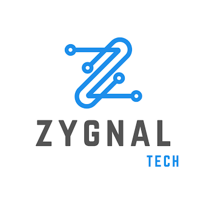

# Zygnal Tech
www.zygnaltech.in (Our new Domain)

[](https://zygnal.tech)
[](https://angular.io)
[](https://tailwindcss.com)
[](https://threejs.org)
[](https://gsap.com)

> **Zygnal Tech** is a modern digital innovation startup crafting immersive web experiences with cutting-edge technologies.

---

## 🌟 About Zygnal Tech

**Zygnal Tech** is a dynamic startup founded with a passion for pushing the boundaries of digital experiences. We specialize in building high-performance, visually stunning web applications that combine beautiful design with powerful interactivity.

Our mission is to transform ideas into exceptional digital products that captivate users and drive business growth.

### Our Vision
To become a leading force in immersive web technologies, helping startups and businesses stand out in the digital landscape through innovative 3D experiences, smooth animations, and seamless user interfaces.

### Our Mission
Deliver cutting-edge digital solutions using modern frameworks like Angular, Three.js, and GSAP while maintaining pixel-perfect design and outstanding user experience.

---

## ✨ What We Do

- **Immersive Web Experiences** — 3D visuals and interactive interfaces
- **Modern Web Applications** — Built with Angular 17 & TypeScript
- **High-End Animations** — Professional GSAP timelines and scroll effects
- **Branding & Digital Presence** — Portfolio sites, landing pages, and SaaS platforms
- **Contact & Lead Generation** — Integrated EmailJS solutions

---

## 🚀 Live Demo & Screenshots

  
  
  


**Explore the live demo**: [zygnal.tech](https://zygnal.tech) *(update with your actual domain)*

---

## 🛠 Tech Stack

| Technology         | Version    | Role                              |
|--------------------|------------|-----------------------------------|
| Angular            | 17.3.0    | Core Framework                    |
| TypeScript         | 5.4       | Development Language              |
| Tailwind CSS       | 3.4       | Utility-First Styling             |
| Three.js           | 0.183.2   | 3D Graphics & WebGL               |
| GSAP               | 3.14.2    | Professional Animations           |
| EmailJS            | 4.4.1     | Backend-less Contact Forms        |
| RxJS               | 7.8       | State Management & Async          |

---

## 📁 Project Structure

```bash
zygnal-tech/
├── src/
│   ├── app/                 # Main Angular application
│   ├── assets/              # Images, 3D models, icons
│   ├── environments/        # Config for dev/prod
│   └── styles.scss          # Global styles
├── angular.json
├── package.json
├── tailwind.config.js       # Custom design system
├── tsconfig.json
└── README.md
